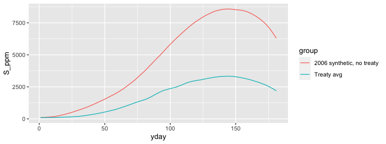

<!-- README.md is generated from README.Rmd. Please edit that file -->

# deltasalinity

<!-- badges: start -->

[](https://travis-ci.com/gopalpenny/deltasalinity)
[](https://codecov.io/gh/gopalpenny/deltasalinity)
<!-- badges: end -->

The goal of deltasalinity is to provide functions to calibrate and
implement a simple advection and first order exchange model of channel
salinity.

## Installation

You can install deltasalinity from
[github](https://github.com/gopalpenny/deltasalinity) with:

``` r
remotes::install_github("gopalpenny/deltasalinity")
```

## Simulating salinity under synthetic conditions

This is a basic example which shows you how simulate salinity at Khulna
in the Ganges delta using built-in streamflow data (`ganges_streamflow`)
and calibrated model parameters (`ganges_params`). The output salinity
(`S_ppm`) is salinity at Khulna in ppm.

``` r
library(deltasalinity)
library(ggplot2)

# Simulate salinity
salinity_results <- ganges_streamflow # create data.frame that will hold results
salinity_results$S_ppm <- sim_salin_annual(ganges_streamflow, ganges_params$param)

# Plot the results
ggplot(salinity_results) + geom_line(aes(yday,S_ppm, color = group))
```



## Package website

More information can be found on the [github.io
site](https://gopalpenny.github.io/deltasalinity/) for this package
